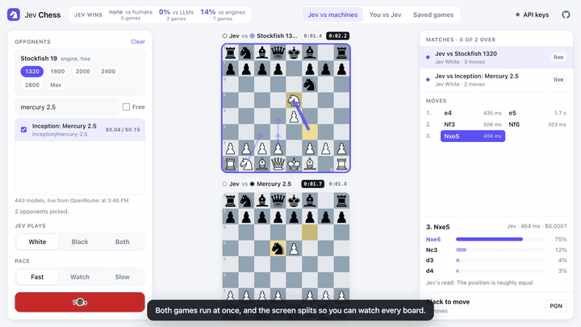
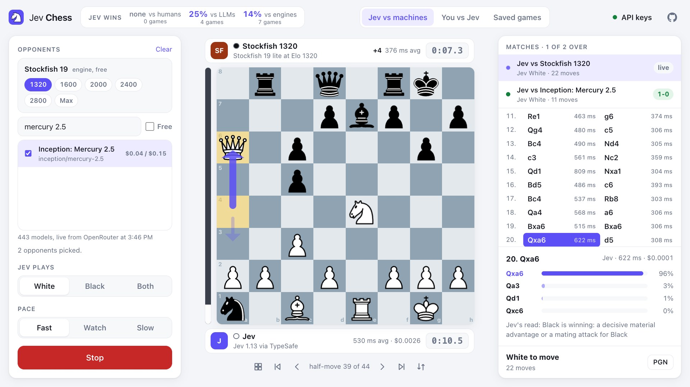

# Jev Chess

Watch **Jev**, TypeSafe's System One model, play chess against any LLM on OpenRouter or against
the Stockfish engine, or play Jev yourself. Every move is shown as it happens, with the moves Jev
weighed and how likely it thought each one was, and every finished game is saved for replay.

**Play it at [jevchess.xera.ac](https://jevchess.xera.ac).** Bring an OpenRouter key: its free
models cost nothing, and Jev runs on it too (with a little credit, since Jev is not free there). A
TypeSafe key works for Jev as well.



<sub>The start of the tour. [Watch the full tour](documentation/tour.mp4) at 1080p, silent with captions: Jev's record, picking Stockfish and an LLM, both games at once on a split screen, one game up close with Jev's probabilities, the results, saved games, a game against Jev, and the dark theme. Every move in it is real: Jev on a TypeSafe key, Mercury 2.5 through OpenRouter, Stockfish in the page.</sub>

## Three modes on one screen

* **Jev vs machines.** Pick opponents: Stockfish 19 at one or more strengths (Elo 1320 to full
  strength) and any number of the LLMs OpenRouter offers, with a switch for the free ones. Choose
  whether Jev plays White, Black or both colors. All games run at once, and the screen splits so
  every board is in view; click a board to follow that game up close, with its moves, Jev's
  probabilities and replay. At the end a table gives Jev's wins, draws and losses against each
  opponent, the time each side took per move, how often an LLM failed to name a legal move, and
  what the games cost.
* **You vs Jev.** Drag or click the pieces, type a move, or turn on voice mode and say it
  ("knight f3", "e4", "bishop takes c4", "castle kingside"): plain moves are read directly, and Jev
  works out looser ones ("put my knight on f3", or "night" misheard for knight) by picking the legal
  move the words name. Jev answers in about a third of a second, the arrows show the moves it
  considered, and in voice mode its reply is read aloud. Voice needs a browser with speech
  recognition (Chrome, Edge, Safari); in Chrome the audio goes to Google to become text.
* **Saved games.** Every finished game, with Jev's record over all of them. Replay any game move by
  move, copy its PGN, or share a link to it.

When a game ends, its board shows the winner or the draw. The header keeps Jev's win rate over
every saved game against humans, LLMs and engines, with the number of games; click it for the
record against each LLM and each Stockfish level.



The layout is one page with no scrolling: setup on the left, the board in the middle, the moves and
the details of the selected move on the right. On a phone the board sits on top and the two panels
share a tab bar. Arrow keys step through the moves and F flips the board. Light and dark themes
follow the system.

## How Jev plays chess

Jev is not a text generator and does not search ahead. It answers typed questions about a state
with calibrated probabilities. So the work is split the way TypeSafe's
[building guide](https://docs.typesafe.ai/concepts/how-to-build-with-system-one) suggests: code
owns the game, Jev supplies the judgment.

1. **Code lists every legal move** with [chess.js](https://github.com/jhlywa/chess.js).
2. **Code describes what each move does, in words.** Jev reads text and is weak at arithmetic, so
   the facts are computed and written out: what it captures and what that is worth, whether it
   gives check or mate, whether the moved piece is safe, defended, or open to a cheaper attacker,
   which enemy pieces it threatens, how much material it likely wins or loses once the opponent
   takes back, which of your pieces it leaves open to capture, whether it lets the opponent mate at
   once, and the material balance after it. For example:

   > `Nxf7`: Knight from e5 to f7. Captures a pawn (worth 1). The knight on f7 is attacked but
   > defended. Threatens the rook on h8 and the queen on g5. Likely wins 1 point of material. White
   > is ahead by 2 points of material.

3. **One request per move** carries the position (board, piece lists, material, threats, the moves
   so far, FEN) and two questions
   ([speculative fan-out](https://docs.typesafe.ai/patterns/fan-out)):

   | Question | Type | Used for |
   | --- | --- | --- |
   | `move` | Choice over every legal move, with priorities (mate, never allow mate, do not give pieces away, take free material, develop and castle) | The move played; the four likeliest are drawn as arrows |
   | `evaluation` | Score over seven levels from "Black is winning" to "White is winning" | The bar beside the board |

A move costs one request of about 3,000 input tokens and takes about 300 ms. At $0.042 per million
input tokens, a whole game costs Jev well under a cent.

**LLMs get the same facts.** An LLM opponent receives the same position and the same described list
of legal moves through OpenRouter's chat completions, and answers with a short idea and a line
`MOVE: <move>`. If a reply names no legal move, the model is told so and asked again; after three
tries a random legal move is played and counted, so a confused model cannot stall the game. The idea
it gave is shown beside its moves.

**Stockfish** is the classic chess engine, the "computer" of chess programs. The lite single
threaded WebAssembly build of Stockfish 19 runs in your browser with its strength limited through
`UCI_Elo`, and thinks for 0.3 s a move. It needs no key.

A game ends by the rules (mate, stalemate, repetition, the fifty-move rule, insufficient material)
or is drawn after 100 moves each.

## Keys and privacy

* Keys are kept in your browser's local storage and sent only to where they are used.
* With a TypeSafe key, Jev always runs on it, never through OpenRouter; without one, Jev runs
  through OpenRouter.
* OpenRouter accepts calls from web pages, so LLM moves and Jev on OpenRouter
  (`typesafe/jev-1.13` through OpenRouter's Decisions API) go straight from your browser to OpenRouter.
* TypeSafe's API does not accept calls from web pages, so a TypeSafe key goes through this site's
  small relay (`POST /v1/systemone`), which passes it on and never stores or logs it.
* Saved games hold the players, the moves, the time per move, the models' short notes and Jev's
  probabilities. The server rebuilds each game field by field from that list and replays every move
  before saving it, so nothing else a page sends, a key included, can reach the disk.

## Run it yourself

Requires Node.js 20.3 or newer. The app has no dependencies.

```sh
npm start        # http://localhost:3141
npm test         # rules, move descriptions, reply parsing, players, Stockfish, saved games
```

`server.mjs` serves `docs/`, relays TypeSafe calls and keeps games in `data/games.jsonl` (`GET
/api/games`, `GET /api/games/<id>`, `GET /api/stats` for Jev's record). `PORT` and `DATA_DIR` set
where it listens and where games go. In production nginx serves `docs/` and passes `/v1/` and
`/api/` to it.

The tour is recorded by `record-tour.mjs` with Google Chrome and ffmpeg (`npm install` fetches
playwright-core for it). It plays real games, so it needs both keys, from the environment only:

```sh
OPENROUTER_API_KEY=... TYPESAFE_API_KEY=... npm run tour -- http://localhost:3141/
```

A live game against the real APIs, printed move by move:

```sh
TYPESAFE_API_KEY=... ENGINE=1600 node test/live.mjs         # Jev vs Stockfish 1600
OPENROUTER_API_KEY=... MODEL=some/model node test/live.mjs  # Jev vs an LLM
```

## Files

```
docs/index.html         the page
docs/app.js             modes, model picker, games, saving, replay
docs/board.js           the board: pieces that slide, drag or click to move, promotion, arrows
docs/chess-ai.js        move descriptions, Jev and LLM requests, Stockfish, the game loop (no DOM)
docs/vendor/chess.js    chess.js 1.4.0 (BSD-2-Clause)
docs/vendor/stockfish/  Stockfish.js 19 lite single threaded (GPLv3, see COPYING.txt)
docs/pieces/            cburnett pieces by Colin M.L. Burnett (CC BY-SA 3.0), as used by lichess
server.mjs              static files, the TypeSafe relay, saved games and Jev's record
test/                   node --test suite and the live game script
record-tour.mjs         records documentation/tour.mp4, tour.gif and screenshot.jpg
```

Inspired by [jev-tetris](https://github.com/trungdq88/jev-tetris), where Jev plays Tetris against
other models in real time.

## License

MIT for this project's code. The bundled chess.js, Stockfish.js and pieces keep their own licenses
listed above.
